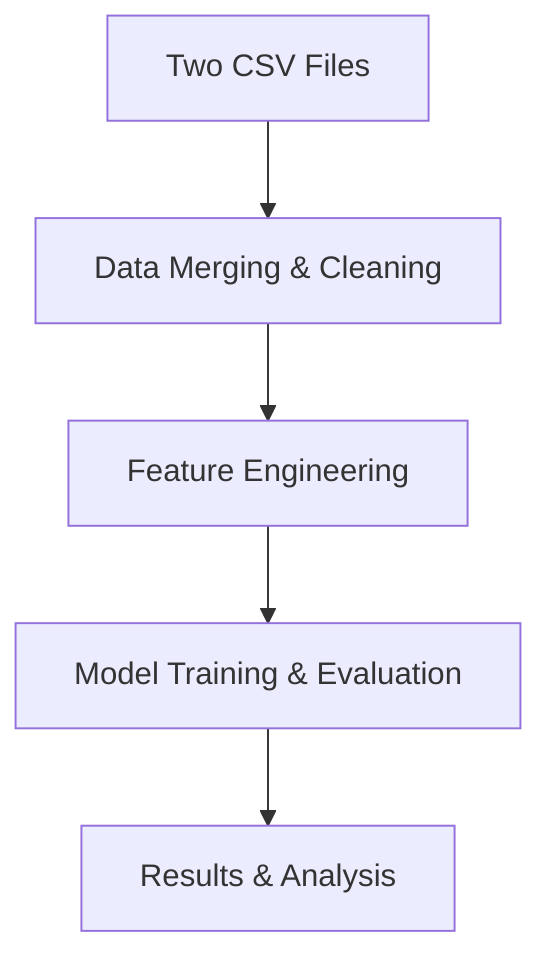

# Design Document

## Overview

This design outlines a streamlined machine learning approach for predicting compressive strength in Cu-Fe based high entropy alloys using two CSV datasets. The system focuses on essential functionality: data merging, feature engineering, model training, and evaluation to achieve maximum accuracy with minimal code overhead.

## Architecture

Simple linear workflow focusing on core functionality:



### Core Functions:

1. **Data Processing**: Load, merge using DOI, handle missing values
2. **Feature Engineering**: Encode categories, normalize compositions, create derived features
3. **Model Training**: Train multiple regression models and ensembles
4. **Evaluation**: Compare models and analyze feature importance

## Components and Interfaces

### 1. Data Processing Module

**Purpose**: Handle data ingestion, DOI-based duplicate detection, and intelligent merging

**Key Classes**:
- `DataIngester`: Loads and validates CSV files
- `DOIDuplicateDetector`: Identifies duplicates using DOI links and composition matching
- `DataMerger`: Implements data-maximizing merge strategy
- `DataCleaner`: Handles missing values and data quality issues

**Interfaces**:
```python
class DataProcessor:
    def load_datasets(self, file_paths: List[str]) -> pd.DataFrame
    def detect_duplicates(self, df: pd.DataFrame) -> Dict[str, List[int]]
    def merge_duplicates(self, df: pd.DataFrame, duplicates: Dict) -> pd.DataFrame
    def generate_merge_report(self) -> Dict[str, Any]
```

### 2. Feature Engineering Module

**Purpose**: Create materials science-relevant features and prepare data for ML models

**Key Classes**:
- `CompositionFeatureExtractor`: Processes element percentages and creates derived features
- `PhaseEncoder`: Handles categorical phase information
- `ProcessingParameterEncoder`: Encodes processing methods and conditions
- `MaterialsPropertyCalculator`: Computes mixing entropy, atomic size differences, etc.

**Interfaces**:
```python
class FeatureEngineer:
    def extract_composition_features(self, df: pd.DataFrame) -> pd.DataFrame
    def encode_categorical_features(self, df: pd.DataFrame) -> pd.DataFrame
    def calculate_materials_properties(self, df: pd.DataFrame) -> pd.DataFrame
    def create_interaction_features(self, df: pd.DataFrame) -> pd.DataFrame
```

### 3. ML Model Factory

**Purpose**: Implement and train multiple regression models with hyperparameter optimization

**Key Classes**:
- `RegressionModelFactory`: Creates instances of different regression models
- `HyperparameterOptimizer`: Performs grid search and cross-validation
- `ModelTrainer`: Handles training pipeline with proper validation splits
- `EnsembleBuilder`: Creates ensemble models from best performers

**Interfaces**:
```python
class MLModelFactory:
    def create_model(self, model_type: str, **kwargs) -> BaseRegressor
    def train_model(self, model: BaseRegressor, X: np.ndarray, y: np.ndarray) -> BaseRegressor
    def optimize_hyperparameters(self, model: BaseRegressor, X: np.ndarray, y: np.ndarray) -> Dict
    def create_ensemble(self, models: List[BaseRegressor]) -> BaseRegressor
```

### 4. Evaluation Framework

**Purpose**: Comprehensive model evaluation with regression-specific metrics

**Key Classes**:
- `RegressionEvaluator`: Calculates RMSE, MAE, R², MAPE, and prediction intervals
- `CrossValidator`: Implements stratified cross-validation for small datasets
- `ModelComparator`: Statistical comparison of model performances
- `ValidationReporter`: Generates detailed evaluation reports

**Interfaces**:
```python
class EvaluationFramework:
    def evaluate_model(self, model: BaseRegressor, X_test: np.ndarray, y_test: np.ndarray) -> Dict
    def cross_validate(self, model: BaseRegressor, X: np.ndarray, y: np.ndarray) -> Dict
    def compare_models(self, models: List[BaseRegressor], X: np.ndarray, y: np.ndarray) -> pd.DataFrame
    def generate_evaluation_report(self, results: Dict) -> str
```

### 5. Feature Importance Analyzer

**Purpose**: Analyze and interpret feature importance for materials science insights

**Key Classes**:
- `FeatureImportanceExtractor`: Extracts importance scores from different model types
- `MaterialsScienceInterpreter`: Connects ML insights to materials science principles
- `VisualizationGenerator`: Creates plots and charts for feature analysis
- `InsightsReporter`: Generates comprehensive insights reports

**Interfaces**:
```python
class FeatureImportanceAnalyzer:
    def extract_importance(self, model: BaseRegressor, feature_names: List[str]) -> pd.DataFrame
    def analyze_feature_relationships(self, X: pd.DataFrame, y: np.ndarray) -> Dict
    def generate_visualizations(self, importance_data: pd.DataFrame) -> List[plt.Figure]
    def create_insights_report(self, analysis_results: Dict) -> str
```

## Data Models

### Primary Data Structures

**RawDataRecord**:
```python
@dataclass
class RawDataRecord:
    id: str
    composition: str
    phases: str
    hardness: Optional[float]
    yield_strength: Optional[float]
    ultimate_tensile_strength: Optional[float]
    elongation: Optional[float]
    compressive_strength: Optional[float]  # Target variable
    plasticity: Optional[float]
    processing_notes: str
    source_doi: str
    element_fractions: Dict[str, float]
```

**ProcessedDataRecord**:
```python
@dataclass
class ProcessedDataRecord:
    original_id: str
    merged_sources: List[str]
    composition_vector: np.ndarray
    phase_encoding: np.ndarray
    processing_encoding: np.ndarray
    materials_properties: Dict[str, float]
    target_compressive_strength: float
    data_quality_score: float
```

**ModelResult**:
```python
@dataclass
class ModelResult:
    model_name: str
    model_instance: BaseRegressor
    cv_scores: Dict[str, float]
    test_scores: Dict[str, float]
    feature_importance: pd.DataFrame
    hyperparameters: Dict[str, Any]
    training_time: float
    prediction_intervals: np.ndarray
```

## Error Handling

### Data Processing Errors
- **Missing DOI**: Log warning and use composition-based matching as fallback
- **Conflicting Values**: Implement resolution hierarchy (completeness > source reliability > averaging)
- **Invalid Compositions**: Flag for manual review and exclude from training if unresolvable
- **Missing Target Values**: Handle through imputation or exclusion based on data availability

### Model Training Errors
- **Insufficient Data**: Implement minimum sample size checks and recommend data augmentation strategies
- **Feature Scaling Issues**: Robust scaling with outlier detection and handling
- **Convergence Problems**: Automatic hyperparameter adjustment and algorithm switching
- **Memory Constraints**: Implement batch processing and feature selection for large feature sets

### Validation Errors
- **Cross-validation Failures**: Fallback to simpler validation strategies
- **Statistical Significance Issues**: Report confidence intervals and uncertainty measures
- **Outlier Detection**: Implement multiple outlier detection methods with consensus approach

## Testing Strategy

### Unit Testing
- **Data Processing**: Test DOI matching, duplicate detection, and merge logic
- **Feature Engineering**: Validate materials property calculations and encoding methods
- **Model Training**: Test individual model implementations and hyperparameter optimization
- **Evaluation**: Verify metric calculations and statistical comparisons

### Integration Testing
- **End-to-End Pipeline**: Test complete workflow from raw data to final predictions
- **Data Flow**: Validate data transformations between pipeline stages
- **Model Persistence**: Test model saving/loading and reproducibility

### Validation Testing
- **Materials Science Validation**: Compare predictions with known materials science trends
- **Cross-Dataset Validation**: Test model generalization across different data sources
- **Robustness Testing**: Evaluate model performance under various data quality conditions

### Performance Testing
- **Scalability**: Test performance with varying dataset sizes
- **Memory Usage**: Monitor memory consumption during feature engineering and training
- **Training Time**: Benchmark model training times for different algorithms

## Implementation Considerations

### Technology Stack
- **Core ML**: scikit-learn, XGBoost, LightGBM for regression models
- **Deep Learning**: TensorFlow/Keras for neural network regression
- **Data Processing**: pandas, numpy for data manipulation
- **Visualization**: matplotlib, seaborn, plotly for analysis and reporting
- **Statistical Analysis**: scipy, statsmodels for statistical testing

### Performance Optimization
- **Feature Selection**: Implement recursive feature elimination and correlation analysis
- **Model Optimization**: Use early stopping, regularization, and ensemble methods
- **Memory Management**: Efficient data structures and batch processing for large datasets
- **Parallel Processing**: Utilize multiprocessing for cross-validation and hyperparameter tuning

### Extensibility
- **Plugin Architecture**: Allow easy addition of new regression algorithms
- **Feature Engineering Modules**: Modular design for adding new materials science features
- **Export Formats**: Support multiple output formats for different use cases
- **API Design**: RESTful API for model serving and prediction requests