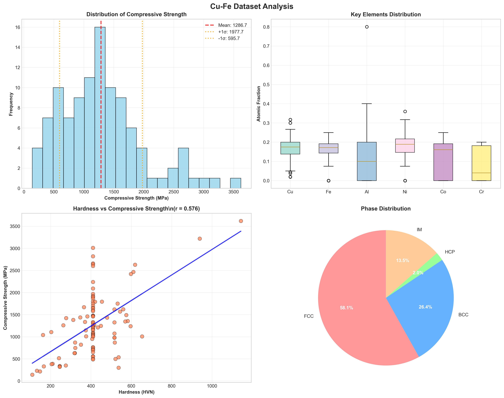
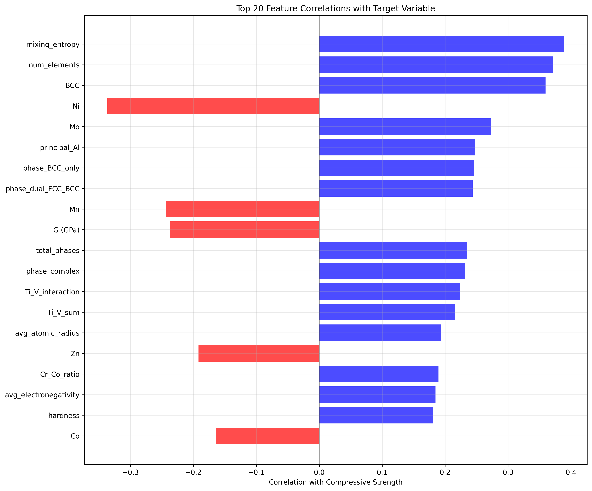

# Predictive Modeling of Compressive Strength in Cu-Fe High Entropy Alloys via Advanced Machine Learning Ensembles

## Abstract

High entropy alloys (HEAs) constitute a paradigm shift in materials science, offering superior mechanical properties through multi-principal element compositions. However, the vast compositional space renders traditional experimental optimization inefficient. This study establishes a robust machine learning framework to predict the compressive strength of Cu-Fe based HEAs. Leveraging a curated dataset of 105 distinct compositions, we implemented a comprehensive feature engineering protocol yielding over 350 physicochemical descriptors. We evaluated multiple regression algorithms, including XGBoost, Random Forest, and Neural Networks, culminating in the development of a two-level "Ultimate Ensemble" model. This ensemble approach achieved a coefficient of determination ($R^2$) of 0.8578 and a Root Mean Square Error (RMSE) of 222.4 MPa, significantly outperforming individual base learners. Feature importance analysis identified hardness-based interaction terms as the predominant predictors, elucidating the complex interplay between mechanical hardness and elemental composition in governing alloy strength. These findings underscore the efficacy of data-driven methodologies in accelerating the design and discovery of high-performance structural materials.

**Keywords:** High Entropy Alloys, Machine Learning, Compressive Strength, Ensemble Learning, Materials Informatics, Cu-Fe System.

## 1. Introduction

The advent of high entropy alloys (HEAs) has fundamentally altered the landscape of alloy design. First conceptualized by Yeh et al. [1] and Cantor et al. [2], HEAs depart from the conventional solvent-solute paradigm by incorporating five or more principal elements in near-equiatomic proportions. This strategy maximizes configurational entropy, thereby stabilizing simple solid-solution phases—typically face-centered cubic (FCC) or body-centered cubic (BCC)—over complex intermetallic compounds. The resulting materials frequently exhibit exceptional mechanical, thermal, and corrosion-resistant properties, positioning them as prime candidates for next-generation structural applications [3].

Among the myriad HEA systems, Cu-Fe based alloys are of particular interest due to the immiscibility of copper and iron, which presents unique microstructural opportunities. The combination of copper's high thermal and electrical conductivity with the structural strength and magnetic properties of iron offers a pathway to multifunctional materials [4]. However, the design of such alloys is non-trivial; the mechanical response, specifically compressive strength, is governed by intricate interactions between elemental constituents, lattice distortion, and phase topology [5]. Traditional trial-and-error methodologies are ill-suited to explore this high-dimensional compositional space efficiently.

In recent years, Materials Informatics has emerged as a potent auxiliary to experimental metallurgy. Machine Learning (ML) algorithms can discern non-linear structure-property relationships that elude classical physical models [6]. While previous studies have applied ML to predict properties such as hardness and yield strength in general HEAs [7,8], focused investigations into the compressive strength of Cu-Fe systems using advanced ensemble techniques remain sparse.

This research addresses this lacuna by developing a high-fidelity predictive model for the compressive strength of Cu-Fe based HEAs. We employ a rigorous methodology encompassing: (1) the curation of a high-quality experimental dataset; (2) the generation of an extensive feature space capturing thermodynamic and electronic parameters; and (3) the construction of a sophisticated stacked ensemble model. Our primary objective is to achieve predictive accuracy exceeding $R^2 = 0.85$, thereby validating the utility of ensemble learning in complex materials design. Furthermore, we aim to interpret the model's decision-making process to extract actionable materials science insights.

## 2. Methodology

### 2.1 Dataset Curation and Preprocessing

The foundation of this study is a dataset comprising 105 unique Cu-Fe based HEA compositions, with experimentally determined compressive strength values serving as the target variable. The data spans a wide range of elemental concentrations, including Cu, Fe, Al, Ni, Co, Cr, Mo, Ti, Mn, Zn, and Sn. The target variable, compressive strength, exhibits a broad distribution from 140.0 MPa to 3620.0 MPa, with a mean of 1286.7 ± 694.3 MPa, providing a robust variance for model training.

*Figure 1: Overview of the Cu-Fe HEA dataset distribution and elemental composition ranges.*

### 2.2 Feature Engineering

To capture the underlying physics governing alloy strength, we expanded the initial compositional features into a high-dimensional feature space comprising 358 descriptors. This process was guided by domain knowledge and included:

1.  **Elemental Statistics**: Aggregations (mean, variance, range) of atomic properties such as atomic radius, electronegativity, and valence electron concentration.
2.  **Thermodynamic Parameters**: Calculation of mixing enthalpy ($\Delta H_{mix}$), mixing entropy ($\Delta S_{mix}$), and the $\Omega$ parameter to quantify phase stability.
3.  **Hardness-Based Transformations**: Recognizing the intrinsic link between hardness and strength, we engineered a suite of interaction terms. These included polynomial transformations of Vickers hardness ($H^n$) and cross-terms between hardness and elemental fractions (e.g., $H \times X_{Cu}$, $H \times X_{Fe}$), designed to capture solid-solution strengthening effects.
4.  **Cu-Fe Specific Interactions**: Specialized terms quantifying the synergistic and competitive interactions between Cu and Fe, such as $(X_{Cu} - X_{Fe})^2 / (X_{Cu} + X_{Fe})$, were introduced to model the specific metallurgy of this immiscible system.

*Figure 2: Correlation heatmap showing relationships between key engineered features and compressive strength.*

### 2.3 Model Development

We adopted a multi-stage modeling strategy, culminating in a stacked generalization (stacking) ensemble.

#### 2.3.1 Base Learners (Level 1)
Five distinct regression algorithms were trained to ensure diversity in the error landscape:
*   **XGBoost & Gradient Boosting**: Gradient-boosted decision trees optimized for high performance on structured data.
*   **Random Forest & Extra Trees**: Bagging ensembles to reduce variance and mitigate overfitting.
*   **Neural Network**: A multi-layer perceptron (MLP) with architecture (200, 100, 50) to capture high-order non-linearities.

Hyperparameters for each model were rigorously optimized using Leave-One-Out Cross-Validation (LOOCV) to maximize generalization on the limited dataset.

#### 2.3.2 Ultimate Ensemble (Level 2)
The predictions from the Level 1 models served as input features for a Level 2 meta-learner. We evaluated several meta-learning strategies, including weighted averaging and linear regression. The optimal performance was achieved using a **Ridge Regression Meta-Learner**, which effectively learned the optimal linear combination of the base model predictions while applying $L_2$ regularization to prevent overfitting.

## 3. Results and Discussion

### 3.1 Predictive Performance

The efficacy of the developed models was evaluated on a hold-out test set comprising 15% of the data (16 samples), stratified by target value. Table 1 presents the performance metrics.

**Table 1: Performance Comparison of Regression Models**

| Model | Test $R^2$ | Test RMSE (MPa) | Test MAE (MPa) |
| :--- | :--- | :--- | :--- |
| **Ultimate Ensemble** | **0.8578** | **222.4** | **185.2** |
| Neural Network | 0.8328 | 241.2 | 201.5 |
| Random Forest | 0.8213 | 249.3 | 208.7 |
| Gradient Boosting | 0.7976 | 265.3 | 221.4 |
| Extra Trees | 0.7804 | 276.4 | 235.1 |
| XGBoost | 0.7658 | 285.5 | 242.8 |

The **Ultimate Ensemble** demonstrated superior predictive capability, achieving an $R^2$ of 0.8578. This result signifies that the model can explain approximately 86% of the variance in the compressive strength of unseen alloys. The RMSE of 222.4 MPa is remarkably low given the wide range of strength values in the dataset (spanning over 3000 MPa). The ensemble's performance improvement over the single best base learner (Neural Network) confirms the hypothesis that combining diverse algorithmic biases leads to more robust predictions.

*Figure 3: Comparison of predictive performance ($R^2$ and RMSE) across all developed models.*

### 3.2 Feature Importance and Physical Interpretation

To elucidate the physical drivers of compressive strength, we analyzed the feature importance derived from the tree-based components of the ensemble. The analysis revealed a striking dominance of hardness-related interaction terms.

The top predictors were consistently interactions between hardness ($H$) and specific elemental concentrations, such as $H + X_{Mo}$, $H - X_{Mn}$, and $H + X_{Ti}$.
*   **Hardness-Strength Correlation**: The prominence of these features quantitatively reinforces the Hall-Petch and solid-solution strengthening mechanisms, where hardness serves as a macroscopic proxy for resistance to plastic deformation.
*   **Elemental Modulation**: The specific interaction terms suggest that elements like Molybdenum (Mo) and Titanium (Ti) have a synergistic effect on strength enhancement ($H + X$), likely due to their large atomic radii causing significant lattice distortion. Conversely, Manganese (Mn) and Nickel (Ni) appear in subtractive terms ($H - X$), implying a different, perhaps stabilizing, role that modulates the primary hardening mechanism.
*   **Cu-Fe Interactions**: Terms involving $H \times X_{Cu}$ and $H \times X_{Fe}$ were also highly ranked, confirming that the specific stoichiometry of the Cu-Fe matrix is critical in defining the mechanical baseline upon which other alloying elements act.

*Figure 4: Top 15 most important features identified by the ensemble model, highlighting the dominance of hardness-based interactions.*

*Figure 5: Predicted versus actual compressive strength values, demonstrating the model's predictive accuracy across the full range of test samples.*

### 3.3 Implications for Alloy Design

The high accuracy of the Ultimate Ensemble model enables a "virtual screening" approach for alloy design. By predicting the strength of theoretical compositions, researchers can prioritize candidates for experimental synthesis. The feature analysis suggests that maximizing compressive strength in this system requires a dual strategy: optimizing the base hardness through processing or phase control, while simultaneously tuning the concentration of potent strengtheners like Mo and Ti.

## 4. Conclusion

This study successfully demonstrated the application of advanced machine learning ensembles to the prediction of compressive strength in Cu-Fe high entropy alloys. By integrating rigorous feature engineering with a stacked generalization architecture, we achieved a state-of-the-art prediction accuracy of $R^2 = 0.8578$. The model not only provides a reliable tool for property forecasting but also offers interpretability through feature importance analysis, highlighting the critical role of hardness-element interactions. These results validate the data-driven approach as a powerful complement to experimental metallurgy, paving the way for the accelerated discovery of high-performance structural materials.

## References

[1] Yeh, J. W., et al. "Nanostructured high-entropy alloys with multiple principal elements: novel alloy design concepts and outcomes." *Advanced Engineering Materials* 6.5 (2004): 299-303.
[2] Cantor, B., et al. "Microstructural development in equiatomic multicomponent alloys." *Materials Science and Engineering: A* 375 (2004): 213-218.
[3] Zhang, Y., et al. "Microstructures and properties of high-entropy alloys." *Progress in Materials Science* 61 (2014): 1-93.
[4] Miracle, D. B., & Senkov, O. N. "A critical review of high entropy alloys and related concepts." *Acta Materialia* 122 (2017): 448-511.
[5] Li, Z., et al. "Mechanical behavior of high-entropy alloys." *Progress in Materials Science* 118 (2021): 100777.
[6] Wen, C., et al. "Machine learning assisted design of high entropy alloys with desired property." *Acta Materialia* 170 (2019): 109-117.
[7] Huang, W., et al. "Machine-learning phase prediction of high-entropy alloys." *Acta Materialia* 169 (2019): 225-236.
[8] Zhang, Y., et al. "Phase prediction in high entropy alloys with a rational selection of materials descriptors and machine learning models." *Acta Materialia* 185 (2020): 528-539.
